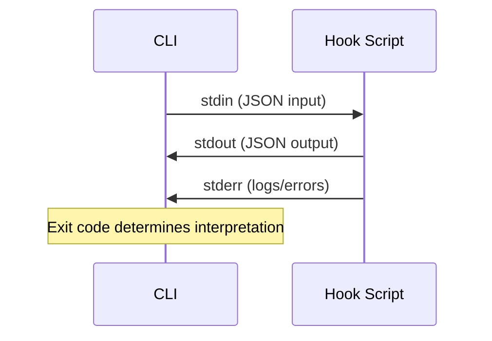

# Hooks

Hooks are event-driven scripts that intercept and modify Gemini CLI operations at key points in the execution lifecycle. They provide a powerful extensibility mechanism for validation, security, auditing, and behavioral customization.

## Overview

The hooks system operates through a strict stdin/stdout JSON protocol between the CLI and hook scripts. This architecture allows external scripts written in any language to participate in the CLI's decision-making pipeline.

## How Hooks Work

**Input via stdin:**
- `session_id`: Unique session identifier
- `transcript_path`: Path to session transcript JSON
- `cwd`: Current working directory
- `hook_event_name`: The triggering event name
- `timestamp`: ISO 8601 execution time

**Output via stdout:**
- `systemMessage`: Displayed immediately to user
- `suppressOutput`: Hides internal metadata
- `continue`: Controls whether agent loop continues
- `decision`: "allow" or "deny" (varies by hook type)
- `reason`: Feedback message when denying

## Hook Categories

| Category | Events | Primary Purpose |
|----------|--------|-----------------|
| [[tool-hooks]] | BeforeTool, AfterTool | Tool validation, security, auditing |
| [[agent-hooks]] | BeforeAgent, AfterAgent | Prompt validation, response quality |
| [[model-hooks]] | BeforeModel, BeforeToolSelection, AfterModel | Request modification, tool filtering |
| [[lifecycle-hooks]] | SessionStart, SessionEnd, Notification, PreCompress | Context loading, cleanup, observability |

## Configuration

Hooks are defined in [[settings-json]] within the `hooks` object. Each event type contains an array of hook definitions with matchers, execution order control, and individual hook configurations.

Key configuration options:
- **matcher**: Regex or exact string to filter when hooks fire
- **sequential**: Controls parallel vs. sequential execution within groups
- **type**: Currently only `"command"` is supported
- **timeout**: Execution timeout in milliseconds (default: 60000)

## Exit Code Semantics

Exit codes have hook-specific meanings:

| Code | BeforeTool | AfterTool | AfterAgent | BeforeModel |
|------|------------|-----------|------------|-------------|
| 0 | Success | Success | Success | Success |
| 2 | Block tool | Hide result | Retry | Block turn |

## Common Use Cases

1. **Security**: Validate tool arguments before execution, block dangerous operations
2. **Auditing**: Log all tool executions and agent decisions
3. **Context Injection**: Add dynamic context to prompts or tool results
4. **Output Filtering**: Hide sensitive data from agent awareness
5. **Validation**: Ensure agent responses meet quality criteria
6. **Tool Routing**: Programmatically redirect tool calls via tail tool calls

## Relationship to Extensions

While [[extensions]] package capabilities for sharing and distribution, hooks provide the runtime interception mechanism. Extensions can contain hook scripts, but hooks can also be defined independently in settings.json.

## Limitations

- **BeforeToolSelection**: Cannot use decision, continue, or systemMessage fields
- **Notification and PreCompress**: Cannot block operations (advisory only)
- **stdout Requirements**: Must output only valid JSON—no plain text debugging
- **Exit Code 2**: Semantics vary significantly across hook types